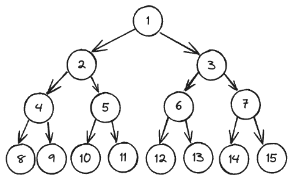
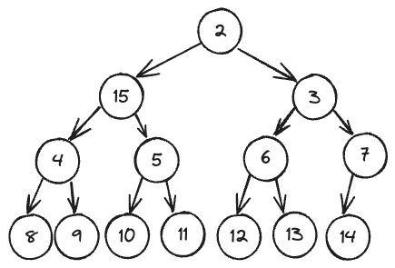

# Lec21: Heaps and Priority Queues Study Guide - Exercises

Ref: https://sp21.datastructur.es/materials/lectures/lec21/lec21

## Recommended Problems

Note: The reason I’ve given lots of problems here is not because this is a more important topic, but because there are just so many interesting problems.

### C level

1. Is an array that is sorted in descending order also a max-oriented heap?
   **Answer**: Yes.

   > **Definition.** A *binary heap* is a collection of keys arranged in a complete heap-or- dered binary tree, represented in level order in an array (not using the first entry).

   A sorted array in descending order totally satisfies the definition.

2. Textbook 2.4.2 (assume we’d also like to support delete operations)

   > **2.4.2** Criticize the following idea: To implement *find the maximum* in constant time, why not use a stack or a queue, but keep track of the maximum value inserted so far, then return that value for *find the maximum*?

   **Answer:** Will need to update the maximum value from scratch after a *remove-the-maximum* operation.

3. [Problem 3](http://www.cs.princeton.edu/courses/archive/spring15/cos226/exams/mid-f09.pdf) from Princeton’s Fall 2009 midterm or [Problem 4](http://www.cs.princeton.edu/courses/archive/spring15/cos226/exams/mid-f08.pdf) from Princeton’s Fall 2008 midterm.

   **Answer fa2009-p3:** 

   a) K M R

   Position 11 is the last position that the one inserted. So the possible keys are along the "KMRT" path. "T" is not possible since "R" can't be placed at the postion 1.

   b)

   ```
               S
          -----/\
         R       O
         /\      /\
       J   M     K A
      /\   |
      E I  H 
   ```

   

   **Answer fa2008-p4:** 

   a)

   ```
               Z
          -----/\
         S       T
         /\      /\
       P   N    R  A
      /\   |\   /
      E I  H G O
   ```

   b)

   ```
               T
          -----/\
         S       R
         /\      /\
       P   N    O  A
      /\   |\   /
      E I  H G 
   ```

   c) True

   Inserting a key larger than any of the N keys amount to `swim` that key from bottom to the top. Every key on the path will go down one level.

   Deleting the maximum key means delete the same key. So the key that smaller than every key on the path will do `sink` operation. The original parent key will get back to its formal place since it is bigger than its children when selected as a child key.

   

4. Why do we leave the 0th position empty in our array representation for heaps?

   **Answer:** 

   > Doing so simplifies the arithmetic a bit. It is not difficult to implement the heap methods based on a 0-based heap where the children of a[0] are a[1] and a[2], the children of a[1] are a[3] and a[4], the children of a[2] are a[5] and a[6], and so forth, but most programmers prefer the simpler arithmetic that we use. Also, us- ing a[0] as a sentinel value (in the parent of a[1]) is useful in some heap applications.

   

### B level

1. (Textbook 2.4.7) The largest item in a heap must appear in position 1, and the second largest must appear in position 2 or 3. Give the list of positions in a heap of size 31 where the kth largest CAN appear, and where the kth largest CANNOT appear for k=2, 3, 4. Assume values are distinct.

   **Answer:** 

   Use the photo 1 of problem 5 at B level. 

   k=2, possible position: 2,3

   k=3, possible position: 2,3,4,5,6,7

   k=4, possible position: 2~15

   The rest position is the place it can't appear.

   

2. (Textbook 2.4.10) Suppose we wish to avoid wasting one position in a heap-ordered array pq[], putting the largest value in pq[0], its children in pq[1] and pq[2], and so forth, proceeding in level order. Where are the parents and children of pq[k]?

   **Answer:**

   Children: 2k + 1, 2k + 2;

   Parents: (k - 1) / 2 

   

3. (Textbook 2.4.21) Explain how to use a priority queue to implement the stack and queue data types.

   **Answer:** Stack is LIFO. Implement a stack with maximum-oriented PQ, assigning each inserted data with a key, the key start at 0 and increase 1 after each inserting.

   Queue is FIFO. Implement a queue with minimum-oriented PQ, assigning each inserted data with a key, the value start at 0 and increase 1 after each inserting.

   

4. (Adapted from Textbook 2.4.27). Add a min() method to a maximum-oriented PQ. Your implementation should use constant time and constant extra space.

   **Answer:** 

   ```java
    public class MaxPQ<Key extends Comparable<Key>>
    {
        private Key min; // constant extra space
        
        public void insert(Key v)
        {
            if(isEmpty()) { // constant time
                min = v;
            } else {
                min = Math.min(min, v);
            }
            pq[++N] = v;
            swim(N);
        }
        public Key min(){ // constant time
            if(isEmpty()){
                throw new IllegalArgumentException("There is no Key in priority queue");
            } else {
                return min;
            }
        }
   
   ```

   An interesting problem, this `min()` function is like a minimum PQ which size is just 1.

   

5. (Textbook 2.4.14) What is the minimum number of items that must be exchanged during a remove-the-max operationin a heap of size N with no duplicate keys? Give a heap of size 15 for which the minimum is achieved. Answer the same qusetion for two and three successive remove-the-maximum operations.

   **Answer:** 

   From the heap below, that node1 >= 3 >= 7 >=15. After node15 setteled at top of the heap, if node15 exchange with 3, then node15 must be exchanged with 7 too. The minimum exchange happened only when node15 exchange with node2. It is possible that node2 > node3.

   

   Hence, minimum number of items that must be exchanged for one move is two( 15 and 2).

   Now `node15 <= node3`, when `node2` removed and `node14` settled at top, there must be an exchange between `node14` and `node3`. After the exchange, the situation for `node14` becomes the same as for `node15` in last `sink` operation, the `node14` has to move at leave once more. So for two successive: (2, 3). For three successive (2, 3, 4).

   

   

6. [Problem 4](http://www.cs.princeton.edu/courses/archive/spring15/cos226/exams/mid-s08.pdf) from Princeton’s Spring 2008 midterm.

7. [Problem 6](https://d1b10bmlvqabco.cloudfront.net/attach/hx9h4t96ea8qv/h32s1vxe6mb5o0/i7vkubmrxjn0/fa14_mt2.pdf) from my Fall 2014 midterm.

8. [Problem 4](http://www.cs.princeton.edu/courses/archive/spring15/cos226/exams/mid-f12.pdf) from Princeton’s 2012 midterm.

9. [Problem 5a and 5b](http://www.cs.princeton.edu/courses/archive/spring15/cos226/exams/mid-s13.pdf) of my Spring 2013 midterm.

10. Problem 3 from my [Fall 2014 midterm](http://berkeley-cs61b.github.io/public_html/materials/exams/fin-f14.pdf).

### A level

1. Design a data type that supports insert in O(log N) time, find-the-median in O(1) time, and delete-the-median in O(log N) time.
2. Design a data type that supports insert in O(log N) time, delete-the-max in O(log N) time, and delete-the-minimum in O(log N) time.
3. [Problem 7](http://www.cs.princeton.edu/courses/archive/spring15/cos226/exams/mid-f10.pdf) from Princeton’s Fall 2010 midterm.
4. [Problem 8](http://www.cs.princeton.edu/courses/archive/spring15/cos226/exams/mid-s12.pdf) from Princeton’s Spring 2012 midterm.