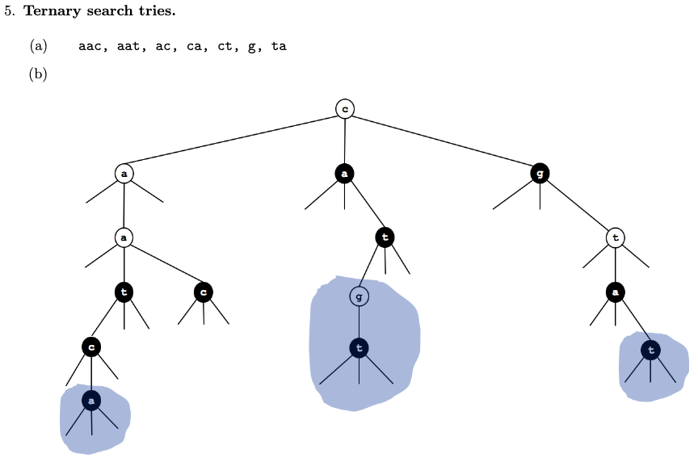
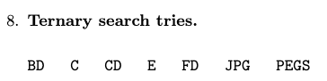
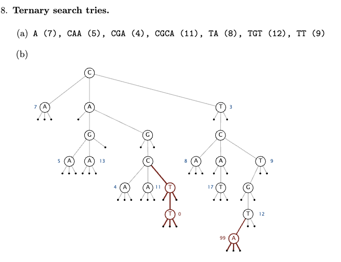
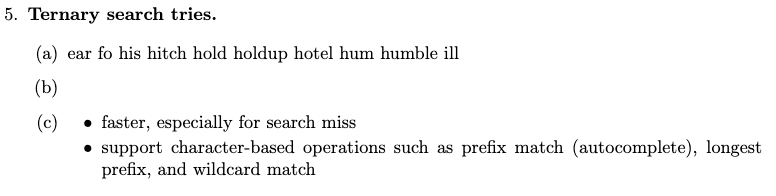
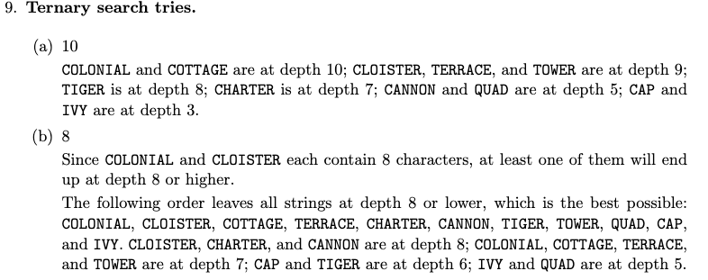
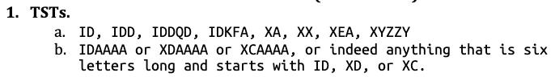

# Lec22: Tries Guide - Exercises

Ref: https://sp21.datastructur.es/materials/lectures/lec22/lec22

## Recommended Problems

Throughout, we define R as the size of the alphabet, and N as the number of items in a trie.

### C level

1. Problem 5 from [Princeton’s Spring 2008 final](http://www.cs.princeton.edu/courses/archive/spring15/cos226/exams/fin-s08.pdf).

   **Answer:**  There isn't any teaching about Ternary Search Tries, why this problem? Just copy the answer here.

   

2. Problem 8 from [Princeton’s Spring 2011 final](http://www.cs.princeton.edu/courses/archive/spring15/cos226/exams/fin-f11.pdf). (It 's not spring, its fall 2011)

   **Answer:** Just copy the answer

   

3. Problem 8 from [Princeton’s Spring 2012 final](http://www.cs.princeton.edu/courses/archive/spring15/cos226/exams/fin-f12.pdf).  (It 's not spring, its fall 2011)

   **Answer:**Just copy the answer

   

4. Draw the R-way trie that result after inserting the strings: sam, sad, sap, same, a, awls.

   **Answer:** Generated by ChatGPT. Using * mark the string.

   ```
          s
           \
            a
           /|\
          d* m* p*
             \
              e*
   
          a*
           \
            w
             \
              l
               \
                s*
   
   ```

   

### B level

1. When looking for a single character string in a Trie, what is the worst case time to find that string in terms of R and N?

   **Answer:** O(L) = O(1), L is length of string.

2. Problem 5 from [Princeton’s Fall 2009 final](http://www.cs.princeton.edu/courses/archive/spring15/cos226/exams/fin-f09.pdf).

   **Answer:** Just copy the answer:

   

3. Problem 9 from [Princeton’s Fall 2012 final](http://www.cs.princeton.edu/courses/archive/spring15/cos226/exams/fin-s12.pdf). (This is actually Spring 2012 final)

   **Answer:**  Just copy the answer:

   

4. Problem 1 from [my Fall 2013 final](http://www.cs.princeton.edu/courses/archive/fall13/cos226/exams/fin-f13.pdf).

   **Answer:** Just copy the answer:

   

5. True or false: The number of character compares required to construct an R-way trie is always less than or equal to the number required to construct an LLRB.

   **Answer:**  The statement holds true in most practical scenarios.

   False case: Consider the set of strings: `["a", "aa", "aaa", "aaaa", "aaaaa", "aaaaaa"]`. 

6. True or false: The number of character compares required to construct an R-way trie is always less than or equal to the number of character accesses needed to construct a hash table.

   **Answer:** The number of character compares required to construct an R-way trie is not always less than or equal to the number of character accesses needed to construct a hash table. This is especially true in cases where the hash table experiences a high number of collisions, leading to additional character accesses.

### A level

1. There are many different data structures that we can use to store the children of an R-way trie node. The simplest but most memory hungry choice is to create an array of length R, with one link per character in the trie. A second choice is to have each node contain a TreeMap that maps a given character to the appropriate node. A third choice is to use HashMaps instead of TreeMaps. is to have each node contain a TreeMaps, some of you used R-way trie nodes that contained HashMaps. For the “average” node, which of these three choices is likely to use the most memory? Why does this mean that this type of node takes longer to construct? 

   **Answer:** Tries uses most memory.  It takes time to allocate memory.

2. Suppose we use an R-way trie to implement a set. For each of the three implementations of an R-way trie node described in problem 2, what are the best and worst case key lookup times in terms of R an N?

   **Answer:** 

   |                       | key type   | `get(x)`         | `add(x)`         |
   | --------------------- | ---------- | ---------------- | ---------------- |
   | Balanced BST          | comparable | Θ(log𝑁)Θ(log*N*) | Θ(log𝑁)Θ(log*N*) |
   | RSC Hash Table        | hashable   | Θ(1)†Θ(1)†       | Θ(1)∗†Θ(1)∗†     |
   | Data Indexed Array    | chars      | Θ(1)Θ(1)         | Θ(1)Θ(1)         |
   | Tries (BST, HT, DICM) | Strings    | Θ(1)Θ(1)         | Θ(1)Θ(1)         |

   *: Indicates "on average"; ††: Indicates items are evenly spread.

3. Problem 9 from [my Fall 2014 midterm 2](http://datastructur.es/sp16/materials/exam/CS61B_Fall2014_MT2.pdf).

   **Answer:** Just copy the answer:

    Keep the children of each node in order by edge label. Traverse the trie, skipping
   those edges that would take you to strings that are less than or greater than the bounds.
   
   **Answer:** Unfortunately, numerals don’t sort like strings. For example, 91 < 100, but the
   string 100 comes before 91.
   
   **Answer:** Their first k characters (at least) are the same.
   
   **Answer:** The characters at the end of a string tell you almost nothing about its ordering,
   so no ordinary traveral of the trie will find keys in sorted order.
