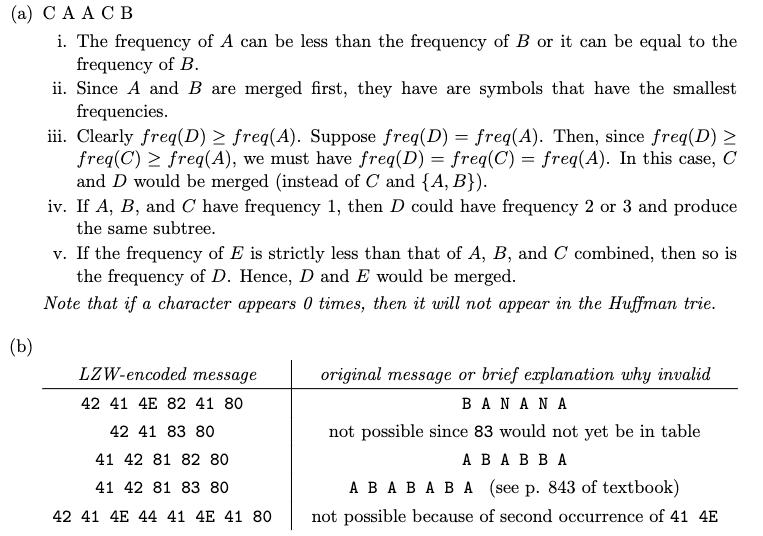

# lec 38 Compression Guide - Exercises

Ref: https://sp21.datastructur.es/materials/lectures/lec38/lec38

## Recommended Problems

### C level

1. Problem [4 from the Princeton 2008 Spring Final](http://www.cs.princeton.edu/courses/archive/fall12/cos226/exams/fin-s08.pdf#page=5).

   16 ∗1 + 8 ∗2 + 4 ∗3 + 2 ∗4 + 1 ∗4 = 56

### B level

1. Inspired by optional textbook 5.5.3: Give an example of a 4 symbol code that is not prefix free or suffix free, but which is still “uniquely decodable”. By uniquely decodable, we mean that any sequence of bits can be unambiguously converted back into the correct sequence of bits.

   The code given:

   - A: 0
   - B: 01
   - C: 10
   - D: 110

   is an example of a 4-symbol code that is not prefix-free or suffix-free but is still uniquely decodable, ensuring that any sequence of bits can be unambiguously converted back into the correct sequence of symbols.

2. Inspired by optional textbook 5.5.13: Suppose that all character frequencies are equal. Describe any interesting features of the resulting Huffman code.

   The Huffman tree will tend to be as balanced as possible because each character has the same frequency. In an ideal scenario, this leads to a nearly complete binary tree, where the depths of the leaves (which represent the characters) are as similar as possible.

3. Problem [10A from the Princeton Fall 2011 Final](http://www.cs.princeton.edu/courses/archive/fall11/cos226/exams/fin-f11.pdf#page=12).

   